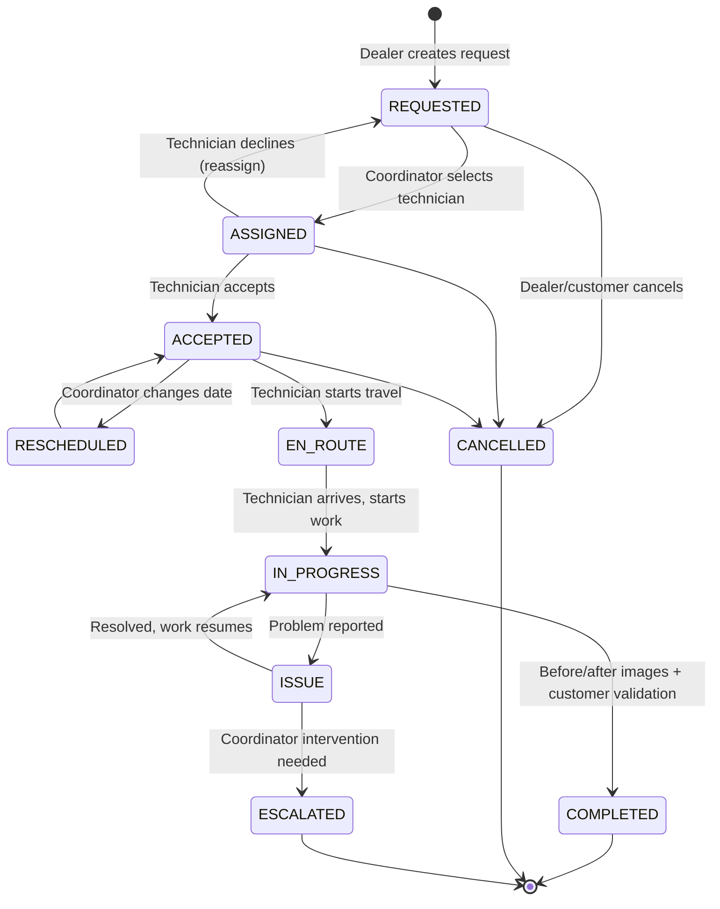

# Technician Management System — Architecture Document

Version 0.1 · Draft for team review

---

## 1. Corrected Tech Stack

| Layer | Choice | Note |
|---|---|---|
| Backend | NestJS | REST API, modular monolith |
| Frontend | **Next.js** (corrected from "NestJS for frontend") | NestJS has no browser runtime; Next.js is required to host shadcn/ui |
| UI | shadcn/ui | Requires React/Next.js underneath |
| DB | PostgreSQL (Supabase-hosted) | |
| Password hashing | bcrypt | |
| Auth | JWT (access + refresh) | Add rotation on refresh — not in original spec |
| Cache | Redis | Also used for WS pub/sub + technician live-location cache |
| Queue | BullMQ | Notifications, SLA timers |
| Real-time | WebSocket (`ws` or Socket.IO) + Redis adapter | Redis adapter added for horizontal-scale readiness |
| Object storage | **AWS S3** | Before/after images |
| Maps/geocoding | **Google Maps or Mapbox** (not in original list) | Distance calc, live map, ETA |
| Notification delivery | **TBD — SendGrid/Twilio or similar** (not in original list) | See §10 Open Decisions |

---

## 2. Roles & Access Model

RBAC alone can't express your actual rules — several are **row-level / ownership scoped**, not just role-permission flags:

| Role | Role-based permission | Row-level scope |
|---|---|---|
| HQ | Read all, manage settings/dealers/technicians, generate reports | None — global |
| Dealer | Create work orders, view own orders | `dealer_id = current_user.dealer_id` |
| Coordinator | Assign/reassign technicians, edit appointment date, view queue | `department = current_user.department` (configurable — confirm with HQ whether department scoping is strict or advisory) |
| Technician | Accept/decline, update status, upload images | `technician_id = current_user.technician_id` on assigned orders only |
| Customer | View own order, rate technician | `work_order_id` tied to a scoped access token (see §10) |

**Implementation approach:** RBAC guard for coarse permission (`@Roles('COORDINATOR')`) + a policy/scoping layer (e.g. CASL, or a custom `ScopedRepository` pattern) applied at the query layer so ownership filtering can't be bypassed by forgetting a `WHERE` clause in a controller. Build this in from day one — retrofitting row-level scoping onto existing CRUD is a common source of data-leak bugs.

---

## 3. Workflow State Machine (revised)

Original chain only covered the happy path. Adding: decline/reassign loop, cancellation, dispute/issue branch, and reschedule as an explicit transition (not just a silent field edit).

Every transition should be written to `work_order_status_history` (see data model) — this is what makes the HQ "Issue task" KPI and SLA reporting queryable instead of hacked together from timestamps.

---

## 4. Data Model

| Entity | Key fields | Notes |
|---|---|---|
| **User** | id, email, phone, password_hash, role, created_at | Base auth identity for HQ/Dealer/Coordinator/Technician |
| **Dealer** | id, user_id (FK), company_name, contact_info | |
| **Coordinator** | id, user_id (FK), department | |
| **Technician** | id, user_id (FK), sub_district, status (available/busy/offline), last_lat, last_lng, rating_avg | Live position cached in Redis; last-known synced to Postgres periodically |
| **Customer** | id, name, phone, email, address, access_token | Lightweight — see §10 on auth model |
| **Device** | id, model, serial_number, ip_address, dealer_id | Charger being serviced |
| **WorkOrder** | id, dealer_id, customer_id, technician_id (nullable), device_id, status, priority, sla_deadline, appointment_date, sub_district, created_at | Core aggregate root |
| **WorkOrderStatusHistory** | id, work_order_id, from_status, to_status, changed_by_user_id, note, changed_at | Audit trail — required for dispute resolution and KPI reporting |
| **WorkOrderImage** | id, work_order_id, type (before/after), url, uploaded_by, uploaded_at | Stored via object storage, URL only in DB |
| **Rating** | id, work_order_id, customer_id, technician_id, score, comment, created_at | |
| **Notification** | id, recipient_id, channel (email/sms), type, payload, status, sent_at | Written by NotificationModule, consumed by BullMQ worker |

---

## 5. Module Boundaries (Modular Monolith, NestJS)

Each module owns its entities and exposes a service interface — no cross-module direct DB access. This keeps the eventual split into microservices (if ever needed) cheap.

- **AuthModule** — JWT issuance/refresh, bcrypt, guards, decorators
- **UsersModule** — base identity, role assignment
- **DealerModule / CoordinatorModule / TechnicianModule / CustomerModule** — role-specific profile data and permissions
- **WorkOrderModule** — state machine, status history, core domain logic (the heart of the system)
- **LocationModule** — WebSocket gateway, Redis pub/sub, technician position cache
- **NotificationModule** — BullMQ producer, email/SMS adapter interface
- **MediaModule** — image upload, object storage adapter
- **RatingModule** — post-completion ratings
- **ReportingModule** — HQ KPI aggregation, SLA breach detection (scheduled jobs)
- **CommonModule** — shared guards, interceptors, validation pipes, scoping policy layer

---

## 6. Real-Time Location Tracking

- **Transport:** WebSocket — justified here since technicians push position *and* receive order updates (true bidirectional need, not just server→client).
- **Scaling:** Start single-node if concurrent technician count is small; wire in the **Redis pub/sub adapter** from the start anyway since Redis is already in the stack — cheap insurance against a painful later migration.
- **Auth:** Validate JWT on the WS upgrade handshake (query param, not header — per WS spec), not just on REST calls.
- **Update frequency:** Throttle to every 5–10s or on meaningful distance change — not every second. Protects technician battery and avoids spamming the customer's map.
- **Reconnection:** Exponential backoff with jitter on the client. Location is last-value-wins, so a full replay buffer isn't necessary — just resend current position on reconnect.
- **Data retention:** Live position lives in Redis (short TTL); only last-known position and completed-order path (if needed for audit) persist to Postgres.

---

## 7. Notification System

- BullMQ queue (`notifications`) — jobs enqueued on: status transitions relevant to customer (accepted, en-route, completed), SLA-approaching alerts (delayed job), issue escalations.
- Consumer worker calls a pluggable channel adapter (email/SMS) — provider TBD (§10).
- Failed sends retried with backoff; failure surfaced to Coordinator dashboard, not silently dropped.

---

## 8. Revised Implementation Order

0. Project structure + module boundaries *(this doc)*
1. Data model + migrations
2. Auth + RBAC/scoping scaffolding — **moved earlier**, even minimal guards should exist before the first real endpoint ships
3. WorkOrder core API + state machine
4. Backoffice CRUD (Dealer/Coordinator/Technician/Customer)
5. Cache management (Redis)
6. Queue management (BullMQ) — notifications, SLA timers
7. Real-time location tracker (WebSocket + Redis adapter)
8. Media module (before/after image upload)
9. Reporting module (HQ KPIs, SLA breach detection)
10. Frontend API integration (Next.js)
11. UI (shadcn/ui)

---

## 9. Not Yet Addressed — Recommend Adding

- API documentation (OpenAPI/Swagger) generated from NestJS decorators
- Testing strategy (unit for state machine transitions at minimum; e2e for auth/scoping)
- Structured logging + basic observability (error tracking, WS connection metrics)
- Multi-tenancy confirmation — multiple dealers exist; confirm data isolation requirements with HQ

---

## 10. Open Decisions

1. **Customer auth model** — full account, or tokenized magic link scoped to one work order? Changes AuthModule scope significantly. *(Still open — needs a decision.)*

2. **Notification providers — recommended (free tier, 2026):**
   - **Email:** Resend (3,000/mo, permanent free) or Brevo (300/day, permanent free). SendGrid's free plan was retired in 2025 — no longer an option.
   - **Primary channel:** LINE Official Account / Messaging API instead of SMS — free within LINE's monthly push quota, and adoption in Thailand is high enough that it likely reaches more of your users than SMS. Use SMS only as a fallback for users without LINE, since no SMS provider has a genuine ongoing free tier (all are pay-per-message).

3. **Maps/geocoding — recommended:** Start on **Google Maps' free tier** (10,000 free events/month per Essentials SKU — Dynamic Maps, Static Maps, Geocoding — as of the March 2025 pricing model). Sufficient for MVP-scale order volume. Keep **OpenStreetMap + Leaflet.js** (genuinely $0, no billing account) as a fallback if volume grows or cost becomes a constraint — trade-off is losing Google's traffic-aware ETA accuracy, which matters if "Estimated time of arrival" is a feature customers rely on.

4. **Department scoping strictness for Coordinator** — hard boundary or advisory/overridable by HQ? *(Still open — needs a decision.)*

5. **Image retention policy** — how long are before/after photos kept, and is there a compliance requirement driving this? *(Still open — needs a decision.)*