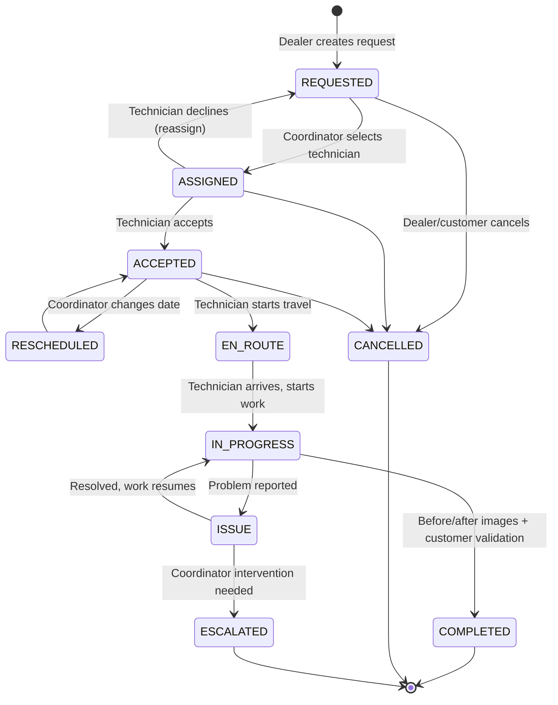

# Technician Management System — Architecture Document

Version 0.1 · Draft for team review

---

## 1. Corrected Tech Stack

| Layer | Choice | Note |
|---|---|---|
| Backend | NestJS | REST API, modular monolith |
| Frontend | **Next.js** (corrected from "NestJS for frontend") | NestJS has no browser runtime; Next.js is required to host shadcn/ui |
| UI | shadcn/ui | Requires React/Next.js underneath |
| DB | PostgreSQL (Supabase-hosted) | |
| ORM | **Prisma 7** (added) | Driver-adapter architecture — requires `@prisma/adapter-pg`; DB URL now lives in `prisma.config.ts`, not `schema.prisma`. See `schema.prisma` + `prisma.config.ts`. |
| Password hashing | bcrypt | |
| Auth | JWT (access + refresh) | Add rotation on refresh — not in original spec |
| Cache | Redis | Also used for WS pub/sub + technician live-location cache |
| Queue | BullMQ | Notifications, SLA timers |
| Real-time | WebSocket (`ws` or Socket.IO) + Redis adapter | Redis adapter added for horizontal-scale readiness |
| Object storage | **Supabase Storage / S3** (not in original list) | Before/after images |
| Maps/geocoding | **OpenStreetMap + Leaflet.js** (switched from Google Maps) | Distance calc, live map, ETA — genuinely $0 with no usage cap, unlike Google's capped free tier. See §11 Open Decisions for the trade-off. |
| Notification delivery | **Resend (email) + LINE Official Account (primary push)** — decided | See §11 Decision #2 |

---

## 2. Roles & Access Model

RBAC alone can't express your actual rules — several are **row-level / ownership scoped**, not just role-permission flags:

| Role | Role-based permission | Row-level scope |
|---|---|---|
| HQ | Read all, manage settings/dealers/technicians, generate reports | None — global |
| Dealer | Create work orders, view own orders | `dealer_id = current_user.dealer_id` |
| Coordinator | Assign/reassign technicians, edit appointment date, view queue | `department = current_user.department` (configurable — confirm with HQ whether department scoping is strict or advisory) |
| Technician | Accept/decline, update status, upload images | `technician_id = current_user.technician_id` on assigned orders only |
| Customer | View own order, rate technician | `work_order_id` tied to a scoped access token (see §10) |

**Implementation approach:** RBAC guard for coarse permission (`@Roles('COORDINATOR')`) + a policy/scoping layer (e.g. CASL, or a custom `ScopedRepository` pattern) applied at the query layer so ownership filtering can't be bypassed by forgetting a `WHERE` clause in a controller. Build this in from day one — retrofitting row-level scoping onto existing CRUD is a common source of data-leak bugs.

---

## 3. Workflow State Machine (revised)

Original chain only covered the happy path. Adding: decline/reassign loop, cancellation, dispute/issue branch, and reschedule as an explicit transition (not just a silent field edit).



Every transition should be written to `work_order_status_history` (see data model) — this is what makes the HQ "Issue task" KPI and SLA reporting queryable instead of hacked together from timestamps.

---

## 4. Data Model

| Entity | Key fields | Notes |
|---|---|---|
| **User** | id, email, phone, password_hash, role, created_at | Base auth identity for HQ/Dealer/Coordinator/Technician |
| **Dealer** | id, user_id (FK), company_name, contact_info | |
| **Coordinator** | id, user_id (FK), department | |
| **Technician** | id, user_id (FK), sub_district, status (available/busy/offline), last_lat, last_lng, rating_avg | Live position cached in Redis; last-known synced to Postgres periodically |
| **Customer** | id, name, phone, email, address, access_token | Magic-link auth, decided — see §11 Decision #1 |
| **Device** | id, model, serial_number, ip_address, dealer_id | Charger being serviced |
| **WorkOrder** | id, dealer_id, customer_id, technician_id (nullable), device_id, status, priority, sla_deadline, appointment_date, sub_district, created_at | Core aggregate root |
| **WorkOrderStatusHistory** | id, work_order_id, from_status, to_status, changed_by_user_id, note, changed_at | Audit trail — required for dispute resolution and KPI reporting |
| **WorkOrderImage** | id, work_order_id, type (before/after), url, uploaded_by, uploaded_at | Stored via object storage, URL only in DB |
| **Rating** | id, work_order_id, customer_id, technician_id, score, comment, created_at | |
| **Notification** | id, recipient_id, channel (email/sms), type, payload, status, sent_at | Written by NotificationModule, consumed by BullMQ worker |

> **Implementation:** `schema.prisma` is the enforced, canonical version of this model — Prisma models, enums, and indexes, plus notes on the handful of constraints (CHECK constraints, partial indexes, materialized views) that Prisma's schema language can't express natively, and how each is handled via custom migration SQL.

---

## 5. Module Boundaries (Modular Monolith, NestJS)

Each module owns its entities and exposes a service interface — no cross-module direct DB access. This keeps the eventual split into microservices (if ever needed) cheap.

- **AuthModule** — JWT issuance/refresh, bcrypt, guards, decorators
- **UsersModule** — base identity, role assignment
- **DealerModule / CoordinatorModule / TechnicianModule / CustomerModule** — role-specific profile data and permissions
- **WorkOrderModule** — state machine, status history, core domain logic (the heart of the system)
- **LocationModule** — WebSocket gateway, Redis pub/sub, technician position cache
- **NotificationModule** — BullMQ producer, email/SMS adapter interface
- **MediaModule** — image upload, object storage adapter
- **RatingModule** — post-completion ratings
- **ReportingModule** — HQ KPI aggregation, SLA breach detection (scheduled jobs)
- **CommonModule** — shared guards, interceptors, validation pipes, scoping policy layer

---

## 6. Real-Time Location Tracking

- **Transport:** WebSocket — justified here since technicians push position *and* receive order updates (true bidirectional need, not just server→client).
- **Scaling:** Start single-node if concurrent technician count is small; wire in the **Redis pub/sub adapter** from the start anyway since Redis is already in the stack — cheap insurance against a painful later migration.
- **Auth:** Validate JWT on the WS upgrade handshake (query param, not header — per WS spec), not just on REST calls.
- **Update frequency:** Throttle to every 5–10s or on meaningful distance change — not every second. Protects technician battery and avoids spamming the customer's map.
- **Reconnection:** Exponential backoff with jitter on the client. Location is last-value-wins, so a full replay buffer isn't necessary — just resend current position on reconnect.
- **Data retention:** Live position lives in Redis (short TTL); only last-known position and completed-order path (if needed for audit) persist to Postgres.

---

## 7. Notification System

- BullMQ queue (`notifications`) — jobs enqueued on: status transitions relevant to customer (accepted, en-route, completed), SLA-approaching alerts (delayed job), issue escalations.
- Consumer worker calls a pluggable channel adapter (email/SMS) — Resend for email, LINE Official Account as primary push, per §11 Decision #2.
- Failed sends retried with backoff; failure surfaced to Coordinator dashboard, not silently dropped.

---

## 8. Revised Implementation Order

0. Project structure + module boundaries *(this doc)*
1. Data model + migrations
2. Auth + RBAC/scoping scaffolding — **moved earlier**, even minimal guards should exist before the first real endpoint ships
3. WorkOrder core API + state machine
4. Backoffice CRUD (Dealer/Coordinator/Technician/Customer)
5. Cache management (Redis)
6. Queue management (BullMQ) — notifications, SLA timers
7. Real-time location tracker (WebSocket + Redis adapter)
8. Media module (before/after image upload)
9. Reporting module (HQ KPIs, SLA breach detection)
10. Frontend API integration (Next.js)
11. UI (shadcn/ui)

---

## 9. Deployment & CI/CD

**Constraint: everything on free tier.** This is achievable, but it converts a monthly hosting bill into ops work — the trade-offs are called out explicitly below rather than glossed over.

### Hosting

| Component | Free option | Trade-off |
|---|---|---|
| Frontend (Next.js) | **Vercel** free tier | None meaningful at this scale — genuinely free |
| Backend (NestJS + WS + BullMQ) | **Oracle Cloud "Always Free" VM** — Ampere A1, 2 OCPU / 12 GB RAM (reduced from 4/24 as of the June 2026 tier change) | Always-on, no sleep — unlike Render/Railway free tiers. But: self-managed TLS (Let's Encrypt/Certbot), process restarts (systemd/Docker restart policies), OS patching, monitoring. Ampere A1 capacity can be temporarily unavailable at instance-creation time in busy regions. **Home region for this project: Singapore** — closest Always-Free-eligible region to Bangkok, meaningfully lower latency than defaulting to a US region. Home region is locked at account creation. |
| Redis | **Upstash** free tier (30 MB, 1,000 req/day) | Priced per-request after free tier — no ops burden, avoids the single-VM fault domain. 30 MB is tight for geocoding cache + location cache + token revoke — monitor growth |
| DB | Supabase Postgres free tier | Already free. **Caveat:** free-tier projects pause after 7 days with no API activity — mitigate with a scheduled daily ping (a free GitHub Actions cron hitting a health endpoint is enough) |
| Object storage | Supabase Storage free tier | 1 GB — fine at MVP scale, watch growth as before/after images accumulate |
| CI/CD runner | GitHub Actions | Free: 2,000 min/month on private repos, unlimited on public — comfortably covers this pipeline |

### Pipeline (GitHub Actions)

No managed platform to git-push to anymore, so the deploy step becomes SSH-based instead of a native integration:

```
On pull_request:
  → lint + typecheck + unit tests
  (blocks merge if failing)

On push to main:
  → npx prisma generate
  → build Docker image
  → push to GitHub Container Registry (ghcr.io — free)
  → SSH into the Oracle VM
  → docker compose pull && docker compose up -d   (STAGING containers)
  → npx prisma migrate deploy   (against staging DB, as its own step — not on app boot)
  → smoke test / health check

On tag v*.*.* (manual release):
  → same image, SSH deploy to PRODUCTION containers on the VM
  → npx prisma migrate deploy   (against prod DB)
  → health check
  → on failure: docker compose up -d with the previous image tag (manual rollback — no platform-native auto-rollback without a managed host)
```

The NestJS app runs in a single container via `docker-compose.yml` on the VM. Redis is managed (Upstash) — no self-hosted container needed. Frontend still deploys separately via Vercel's native GitHub integration.

### Rollback caveat specific to Prisma

Prisma Migrate does not auto-generate down-migrations — rolling back the app image does **not** roll back an already-applied schema migration. If a bad migration ships:
- Write a new forward migration that undoes the change (`prisma migrate dev --name revert_x`) rather than trying to "undo" the old one
- If a migration is stuck half-applied, `prisma migrate resolve --rolled-back <migration-name>` marks it so the next deploy re-applies cleanly
- Practical consequence: app rollback and schema rollback are two separate operations. Keep migrations backward-compatible with the previous app version for one deploy cycle (add columns before removing old ones in a later release) so an app-only rollback never depends on a schema rollback that can't happen automatically

### Build-time note

`prisma generate` must run during the Docker build step, before `npm run build`. Since Prisma 7 reads the DB connection from `prisma.config.ts` rather than `schema.prisma` directly, make sure that config resolves even when the build container has no live DB connection (fall back to `process.env.DATABASE_URL!` directly rather than requiring a real connection at build time).

### Environments

Two is enough at this stage — **staging** and **production** as separate container sets on the same VM (or two VMs, if the 2 OCPU/12 GB budget allows splitting), with production deployed manually via tag so a bad merge can't reach real dealers/technicians without a deliberate release step.

### Zero-downtime WebSocket deploys

When a deploy replaces the backend container, in-flight WS connections (technicians mid-shift) shouldn't just drop — send a `reconnect_hint` message before shutdown so clients reconnect cleanly to the new container instead of silently losing location updates for a few seconds.

### Operational risks of an all-free-tier stack

Worth being explicit about, since these don't show up with a paid managed host:
- **Oracle may reclaim idle instances** — keep baseline activity on the VM (the app itself running counts)
- **No managed auto-restart on crash** by default — set up Docker restart policies (`restart: unless-stopped`) and/or a systemd unit, not optional here
- **You own the security patching** for the VM's OS — unlike Render/Railway, nobody does this for you
- **Single point of failure** — one VM means no built-in redundancy; acceptable for MVP, worth revisiting before this is business-critical

---

## 10. Not Yet Addressed — Recommend Adding

- API documentation (OpenAPI/Swagger) generated from NestJS decorators
- Testing strategy (unit for state machine transitions at minimum; e2e for auth/scoping)
- Structured logging + basic observability (error tracking, WS connection metrics)
- Multi-tenancy confirmation — technical default set (row-level via `dealer_id`), still needs HQ business sign-off on whether any dealer contract requires stricter isolation — see §11 Decision #8

---

## 11. Decision Log

Closed per team sign-off. One item (#6) has a technical default in place but still needs HQ business/contractual confirmation — that distinction matters, so it's kept separate rather than marked fully closed.

### Closed

1. **Customer auth model → Magic-link.** Tokenized `access_token` scoped to a single work order, not a full account. Customers only need occasional, single-purpose access — a full account adds password-reset/account-management surface for no real benefit here. Already scaffolded in `schema.prisma` (`Customer.accessToken`).

2. **Notification providers → Resend (email) + LINE Official Account (primary push).** SMS dropped entirely — no provider has a genuine free tier, and LINE reaches further in the Thailand market anyway. Resend picked over Brevo for cleaner API/DX; 3,000/mo free volume is well above expected MVP notification load.

3. **Maps/geocoding → OpenStreetMap + Leaflet.js + Nominatim, with Redis-cached geocoding results.** Confirmed per the all-free-tier constraint. The caching layer isn't optional polish — Nominatim's public-instance usage policy caps requests at 1/second, so caching geocoded addresses is required to stay compliant with their terms, not just a performance nicety.

4. **Department scoping → Hard boundary, HQ bypasses by default.** No separate advisory/override system gets built — HQ's existing global-read permission already functions as the override path, so a hard boundary for Coordinators is the safer default with no extra engineering cost.

5. **Image retention → 12 months, auto-deleted via a scheduled BullMQ job.** Flat default across all dealers for now; per-dealer configurability is deferred until an actual contract requires it (not built speculatively).

6. **Billing/invoicing → Out of scope for v1.** Nothing in the original spec's visibility/access matrix mentioned payment, pricing, or invoicing — this was never actually in scope, just unstated. No price field added now. Schema extension point for later: a future `Invoice` model referencing `WorkOrder` + `Dealer`, with "who pays" (dealer vs. customer) as a v2 design question, not a v1 one.

7. **Technician-to-sub-district → Kept as 1:1, but as a filter hint, not a hard constraint.** `Technician.subDistrict` drives the Coordinator's default filtered view and the "available technician" queue — it does not restrict which technician can actually be assigned to a work order. A Coordinator can still manually assign any technician to any order regardless of area match. Worth stating explicitly here so this doesn't get misread later as a business rule and accidentally hard-coded into a validation check.

### Still open — needs HQ business sign-off, not an engineering call

8. **Multi-tenancy isolation.** Technical default is in place and sufficient to build against: row-level isolation via `dealer_id` scoping (already the design in §2 and `schema.prisma`). What's still missing is confirmation from HQ on whether any dealer contract requires stricter isolation (e.g., a dedicated schema or database per large enterprise dealer) — that's a contractual/compliance question, not a technical trade-off, so it's the one item on this list that genuinely can't be closed without their input. Engineering isn't blocked either way; the row-level default holds until told otherwise.